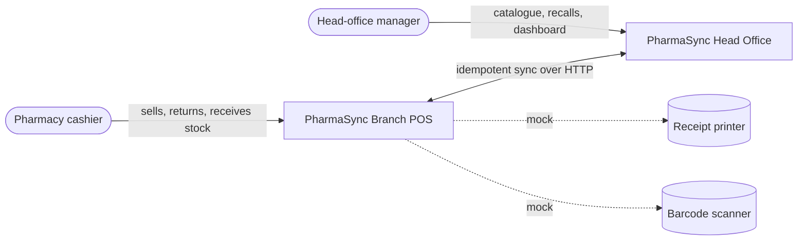
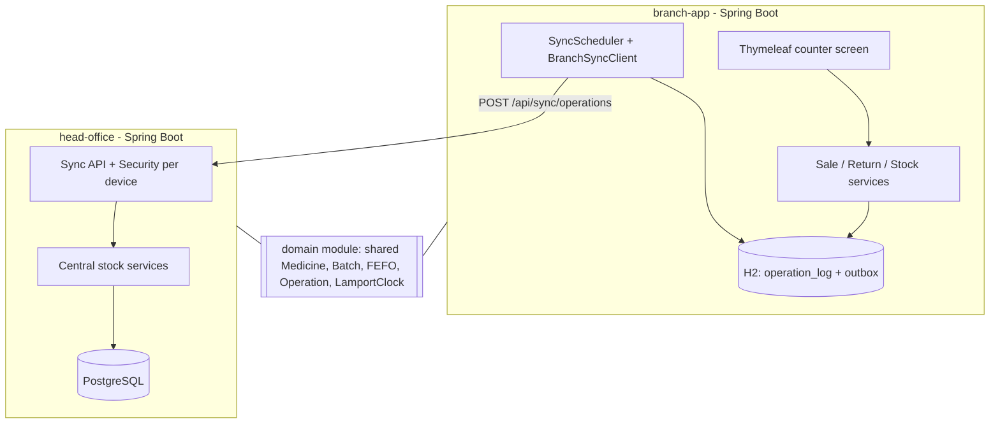
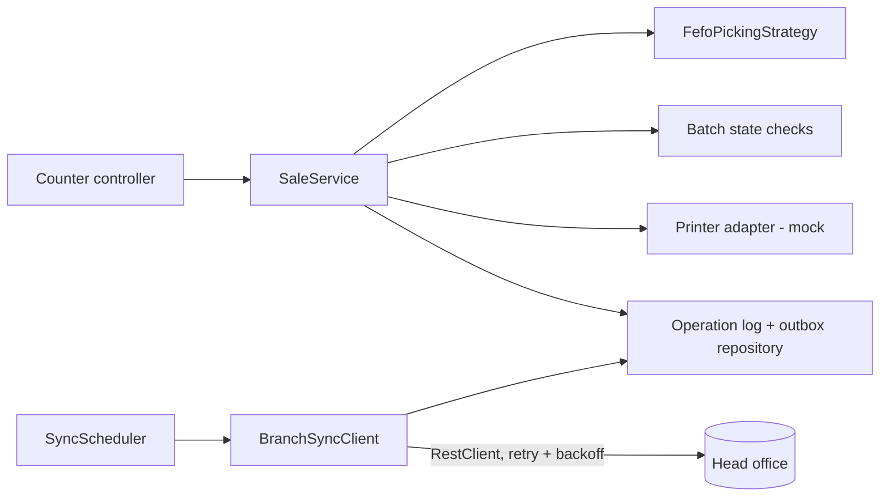

# C4 diagrams

## Level 1: System context

```mermaid
flowchart LR
  Cashier([Pharmacy cashier]) -->|sells, returns, receives stock| Branch[PharmaSync Branch POS]
  Manager([Head-office manager]) -->|catalogue, recalls, dashboard| HO[PharmaSync Head Office]
  Branch <-->|idempotent sync over HTTP| HO
  Branch -.->|mock| Printer[(Receipt printer)]
  Branch -.->|mock| Scanner[(Barcode scanner)]
```

## Level 2: Containers

```mermaid
flowchart TB
  subgraph BranchApp[branch-app - Spring Boot]
    UI[Thymeleaf counter screen]
    BSvc[Sale / Return / Stock services]
    Outbox[(H2: operation_log + outbox)]
    Sync[SyncScheduler + BranchSyncClient]
    UI --> BSvc --> Outbox
    Sync --> Outbox
  end
  subgraph HeadOffice[head-office - Spring Boot]
    API[Sync API + Security per device]
    HSvc[Central stock services]
    PG[(PostgreSQL)]
    API --> HSvc --> PG
  end
  Domain[[domain module: shared Medicine, Batch, FEFO, Operation, LamportClock]]
  BranchApp --- Domain
  HeadOffice --- Domain
  Sync -->|POST /api/sync/operations| API
```

## Level 3: Components (branch-app)

```mermaid
flowchart LR
  Controller[Counter controller] --> SaleService
  SaleService --> Fefo[FefoPickingStrategy]
  SaleService --> BatchState[Batch state checks]
  SaleService --> Printer[Printer adapter - mock]
  SaleService --> OpLog[Operation log + outbox repository]
  Scheduler[SyncScheduler] --> Client[BranchSyncClient]
  Client --> OpLog
  Client -->|RestClient, retry + backoff| Remote[(Head office)]
```
